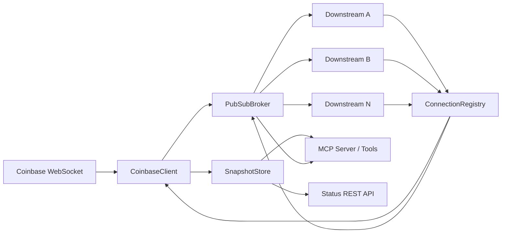
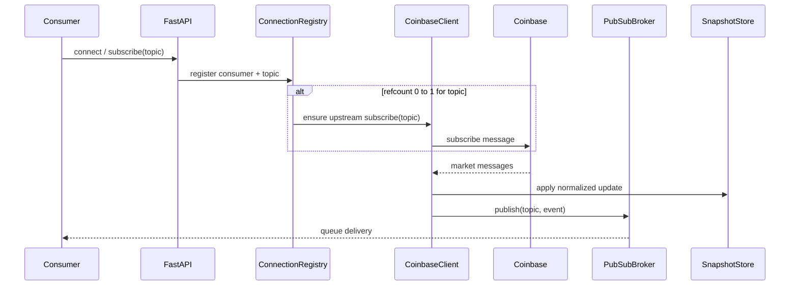
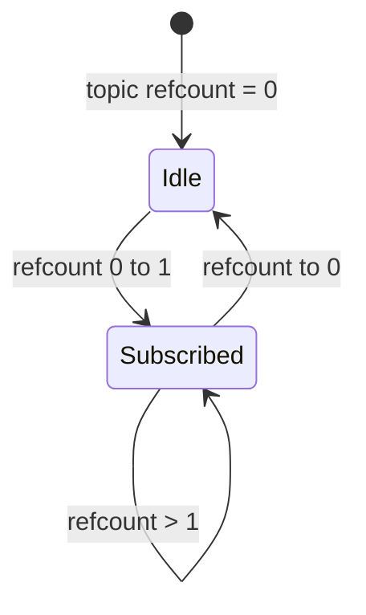
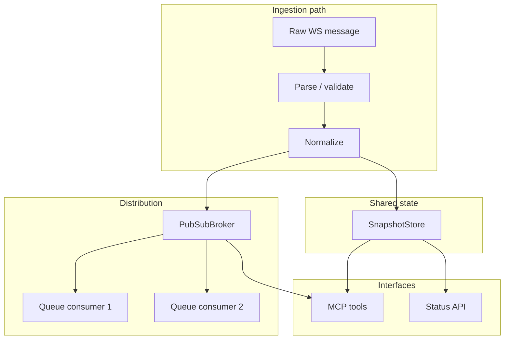

# Market Data Hub — System Architecture

This document describes the architecture of the real-time crypto market data hub: a single-process, asyncio-driven service that owns one upstream WebSocket to Coinbase, normalizes market events, maintains in-memory snapshots, and fans updates out to many downstream consumers. It also exposes operational REST endpoints and an MCP surface for LLM agents.

**Scope:** The design follows the module layout and responsibilities defined in [PROJECT_SUMMARY.md](./PROJECT_SUMMARY.md). Where implementation details are left to code (for example, exact queue overflow policy), this document states the engineering intent and what must remain true for correctness and operability.

---

## 1. System Overview

### 1.1 Purpose

The hub answers one question reliably: **how do multiple consumers get consistent, low-latency market updates from a single exchange feed without each opening their own upstream connection?** It centralizes ingestion, applies a single normalization model, and distributes events through an internal pub/sub layer while preserving **upstream subscription efficiency** (one logical subscription per topic while downstream demand exists).

### 1.2 Centralized hub model

All live market data enters through **one owned upstream path** (Coinbase WebSocket). Downstream clients (browser WebSockets, internal services, MCP-driven agents) never talk to Coinbase directly. Benefits:

- **Rate and connection limits** are enforced in one place.
- **Parsing and schema** stay consistent across REST, WebSocket, and MCP.
- **Operational visibility** (uptime, rates, stale topics) is centralized.

### 1.3 Single upstream / many downstream

Upstream is **1×** per deployment (single process, single Coinbase session strategy). Downstream is **N×** with isolated delivery queues so one slow reader does not block the event loop for others.

### 1.4 MCP integration goals

[MCP](https://modelcontextprotocol.io/) exposes the **same** topic names, snapshot semantics, and stream contracts that engineers use elsewhere. Goals:

- **Discoverability:** agents list topics and schemas without reading Python.
- **Typed actions:** tools map to clear intents (`get_topic_snapshot`, `subscribe_to_topic_stream`, …).
- **Safe defaults:** errors and empty snapshots are explicit so agents do not silently hallucinate prices.

### 1.5 In-memory design rationale

Snapshots, subscriber tables, and metrics live **in RAM** for:

- **Latency:** sub-millisecond reads for snapshots and fan-out without I/O.
- **Simplicity:** no migration, replication lag, or cache invalidation across a DB cluster.
- **Scope alignment:** historical replay, auth, and multi-region scale are explicit non-goals (see PROJECT_SUMMARY).

**Trade-off:** process restart drops all subscriptions and snapshot state; clients must reconnect and resubscribe. This is documented as expected behavior, not a defect.

---

## 2. High-Level Architecture

### 2.1 Major components

| Layer | Responsibility |
|--------|----------------|
| **FastAPI app** (`app/main.py`) | HTTP/WebSocket routing, lifespan (startup/shutdown), dependency wiring. |
| **Configuration** (`app/config.py`) | URLs, queue bounds, stale thresholds, logging, reconnect tuning. |
| **Runtime / DI** (`app/runtime.py`) | Singletons: `CoinbaseClient`, `ConnectionRegistry`, `PubSubBroker`, `SnapshotStore`. |
| **Ingestion** (`app/ingestion/coinbase_client.py`) | WebSocket I/O, reconnect, subscribe/unsubscribe to Coinbase, parse + normalize, publish inward. |
| **Registry** (`app/registry/connection_registry.py`) | Consumer identity, topic refcounts, metrics, lifecycle hooks to broker + client. |
| **Pub/sub** (`app/pubsub/broker.py`) | Topic channels, per-subscriber bounded queues, non-blocking fan-out. |
| **Snapshots** (`app/cache/snapshot_store.py`) | Latest bid/ask/trade/mid per topic, timestamps, stale flags. |
| **MCP** (`app/mcp/server.py`, `app/mcp/tools.py`) | Tool definitions and handlers reading registry + snapshots + streams. |
| **Status API** (`app/api/status_routes.py`) | Health, status, topic list, snapshot fetch for humans and monitors. |

### 2.2 Layer responsibilities (concise)

- **Edge (FastAPI):** authentication is out of scope; the edge validates protocol-level concerns (WebSocket accept, JSON shape for control messages) and delegates business rules to the registry and broker.
- **Demand tracking (registry):** decides **when** the hub needs an upstream Coinbase subscription for a topic.
- **Distribution (broker):** decides **how** each consumer receives a stream without coupling consumers to each other.
- **State (snapshot store):** decides **what** the latest consolidated view is for REST/MCP and for “current price” questions.
- **Ingestion (client):** owns **all** Coinbase-specific protocol details so other layers stay venue-agnostic.

### 2.3 Data flow (control vs events)

**Control plane:** subscribe / unsubscribe / disconnect paths update the registry and may create or tear down upstream subscriptions.

**Data plane:** inbound messages are parsed once, normalized once, written to the snapshot store, then copied to each interested subscriber queue.

---

## 3. Component Breakdown

### 3.1 FastAPI app

| | |
|--|--|
| **Responsibility** | Application lifecycle, routing, and orchestration: mount status routes, WebSocket entrypoints, MCP integration point (depending on chosen MCP mounting strategy), and graceful shutdown ordering. |
| **Inputs** | HTTP requests, WebSocket connections, process signals via uvicorn lifespan. |
| **Outputs** | HTTP/WebSocket responses; triggers to start/stop background tasks (upstream reader loop). |
| **Internal behavior** | On startup: construct or resolve singletons from `runtime`, start `CoinbaseClient` connection manager task if designed that way, warm logging. On shutdown: cancel tasks, close WebSockets, flush metrics. |
| **Interactions** | Injects or resolves `ConnectionRegistry`, `PubSubBroker`, `SnapshotStore`, `CoinbaseClient` into route handlers and MCP tool context. |

### 3.2 CoinbaseClient

| | |
|--|--|
| **Responsibility** | Single place for Coinbase WebSocket protocol: connection, heartbeat handling, resubscribe after reconnect, parsing raw frames, normalizing into internal event types, emitting those events to the broker and snapshot layer. |
| **Inputs** | Commands from registry (“ensure subscribed to BTC-USD”), raw bytes/JSON from WebSocket, configuration (URL, heartbeat expectations, backoff parameters). |
| **Outputs** | Normalized events on internal channels; subscription acknowledgements or errors surfaced to logs/registry as appropriate. |
| **Internal behavior** | Long-lived asyncio task(s): read loop, optional write queue, reconnect with backoff, idempotent “desired subscriptions” set synchronized with actual upstream state after reconnect. |
| **Interactions** | **From** registry: refcount-driven subscribe/unsubscribe requests. **To** `PubSubBroker`: publish by topic. **To** `SnapshotStore`: merge updates. **Reads** config only; does not know about individual downstream sockets. |

### 3.3 ConnectionRegistry

| | |
|--|--|
| **Responsibility** | Authoritative map of **who** is connected, **what** topics they care about, and **how many** logical subscriptions back each topic (refcount). Emits side effects when refcount crosses 0↔1 boundaries. |
| **Inputs** | Consumer connect/disconnect, subscribe/unsubscribe API from FastAPI WebSocket handler, optional admin operations. |
| **Outputs** | Commands to `CoinbaseClient` and `PubSubBroker` (register/unregister consumer queues), metrics for status API. |
| **Internal behavior** | Per-consumer state: connection id, subscribed topic set, timestamps. Per-topic refcount: increment on new unique consumer-topic pair, decrement on unsubscribe or disconnect cleanup. |
| **Interactions** | **Drives** upstream demand. **Coordinates** with broker so each consumer has a dedicated subscription handle and cleanup is total (no orphan queues). |

### 3.4 PubSubBroker

| | |
|--|--|
| **Responsibility** | Topic-oriented fan-out: many producers (conceptually one primary: ingestion) to many consumers with **isolated** delivery queues. |
| **Inputs** | `publish(topic, message)` from ingestion; `subscribe` / `unsubscribe` from registry on behalf of consumers. |
| **Outputs** | Async iterators or queues consumed by WebSocket send loops; optional drop/overflow signals for metrics. |
| **Internal behavior** | Maintains a structure like `topic -> set of subscriber queues`. Each queue is **bounded** (`asyncio.Queue(maxsize=…)` from settings). Publish path must not await a slow consumer’s queue indefinitely (see §7). |
| **Interactions** | **Ingestion** publishes. **FastAPI** consumer tasks read. **MCP** stream tools may attach via the same broker abstraction to avoid duplicating fan-out logic. |

### 3.5 SnapshotStore

| | |
|--|--|
| **Responsibility** | Materialized “now” view per topic for REST/MCP and for quick sanity checks without replaying the stream. |
| **Inputs** | Normalized events from `CoinbaseClient` (trades, quotes, or merged “ticker” updates depending on product mapping). |
| **Outputs** | Read APIs: get snapshot, staleness evaluation, optional “last update time”. |
| **Internal behavior** | Atomic updates per topic (asyncio.Lock per topic or single writer discipline); stale detection compares event time or last receive time against configured thresholds; exposes explicit “stale” or “unavailable” states. |
| **Interactions** | **Written** only from ingestion path (or a single writer module) to avoid races. **Read** by MCP tools and status routes. |

### 3.6 MCP server

| | |
|--|--|
| **Responsibility** | Host MCP capability negotiation and route tool invocations into application services with correct typing and error surfaces. |
| **Inputs** | MCP JSON-RPC messages from hosted transport (stdio and/or HTTP, per deployment). |
| **Outputs** | Tool results and structured errors. |
| **Internal behavior** | Thin adapter: no business logic duplicated; validates arguments, calls registry/snapshot/broker, formats responses for LLM consumption. |
| **Interactions** | Same singletons as FastAPI; must not construct a second parallel hub state. |

### 3.7 MCP tools

| | |
|--|--|
| **Responsibility** | Curated, action-oriented operations (see PROJECT_SUMMARY): list topics, describe schema, read snapshot, attach to stream. |
| **Inputs** | Tool arguments (topic id, optional filters). |
| **Outputs** | JSON-serializable payloads with explicit fields for empty, stale, or error conditions. |
| **Internal behavior** | Each tool maps to one clear application use case; descriptions carry **when to use** and **failure modes** so agents self-select correctly. |
| **Interactions** | Read-only for discovery; snapshot reads; streaming coordinates with broker and respects backpressure policy. |

### 3.8 Status API

| | |
|--|--|
| **Responsibility** | Human- and monitor-friendly HTTP: liveness, rich status, topic catalog, snapshot by topic. |
| **Inputs** | HTTP GETs. |
| **Outputs** | JSON for dashboards and curl debugging. |
| **Internal behavior** | Aggregates metrics from registry and ingestion (rates, connection uptime, subscriber counts). |
| **Interactions** | Reads `SnapshotStore` and registry metrics; does not mutate subscription state (unless explicitly extended later). |

---

## 4. Subscription Lifecycle

### 4.1 Downstream consumer connects

1. Client opens a WebSocket (or equivalent stream) to FastAPI.
2. Handler assigns a **consumer id** and registers an empty subscription set with `ConnectionRegistry`.
3. Broker may pre-create a per-consumer queue map entry to avoid races on first subscribe.

### 4.2 Consumer subscribes to a topic

1. Client sends a control message `{ "op": "subscribe", "topic": "BTC-USD" }` (illustrative shape).
2. Registry validates topic syntax against allowed patterns; unknown or unsupported topics yield an **explicit error** to the client without altering upstream state.
3. If the pair `(consumer_id, topic)` is new, registry **increments** the topic refcount.

### 4.3 Refcount increment and upstream creation

When a topic’s refcount transitions **from 0 to 1**:

1. Registry calls `CoinbaseClient.ensure_subscribed(topic)`.
2. Client adds the topic to its desired set and sends Coinbase subscribe frames (batching if the protocol and limits allow).
3. Until the first successful messages arrive, snapshot for that topic may be empty or marked warming; documentation (e.g. `docs/TOPICS.md`) should state this.

### 4.4 Message fan-out

1. Ingestion receives a message, parses JSON, validates minimal schema.
2. Normalized event is applied to `SnapshotStore` for that topic.
3. `PubSubBroker.publish(topic, event)` enqueues to every active subscriber queue for the topic.
4. Each consumer’s sender task drains its own queue independently.

### 4.5 Unsubscribe flow

1. Client sends unsubscribe or server initiates topic removal.
2. Registry decrements refcount for that consumer-topic pair; broker detaches that consumer’s queue from the topic fan-out list.
3. If refcount **remains > 0**, upstream subscription stays.

### 4.6 Disconnect cleanup

On socket close (normal or abnormal):

1. Registry iterates that consumer’s topics and decrements refcounts as if unsubscribed all at once.
2. Broker drops queue handles and cancels sender tasks tied to that consumer.
3. No memory retention of per-consumer queues after cleanup completes.

### 4.7 Upstream teardown at refcount zero

When a topic’s refcount hits **0**:

1. Registry calls `CoinbaseClient.ensure_unsubscribed(topic)` (or updates desired set).
2. Client sends Coinbase unsubscribe and removes topic from active upstream state.
3. Snapshot row may remain as last known (optional) or be marked stale/unavailable—product choice; must be documented consistently in REST/MCP.

---

## 5. Data Flow

### 5.1 End-to-end path

1. **Ingestion:** Coinbase sends channel-specific payloads (ticker, level2, matches, etc.—exact channels are an implementation detail isolated in `coinbase_client.py`).
2. **Normalization:** Client maps wire format to internal **canonical event** (topic id, event type, numeric fields, exchange timestamp, receive timestamp).
3. **Snapshot updates:** Snapshot store merges canonical events into per-topic aggregate fields (last trade, best bid/ask, mid, timestamps).
4. **Pub/sub distribution:** Broker copies the canonical event (or a projection) to each subscriber queue for that topic.
5. **MCP query flow:** Tool handler reads snapshot store and/or opens a stream via broker; returns structured JSON with staleness and errors explicit.
6. **REST query flow:** Status routes return similar data for operators; same snapshot source guarantees **one truth** for “current” view.

---

## 6. Reconnect Strategy

### 6.1 Upstream reconnect handling

When the Coinbase WebSocket drops (network blip, server idle close, protocol error):

1. Ingestion marks upstream **disconnected**, stops treating the socket as writable, and enters reconnect state machine.
2. Status metrics reflect disconnect; topics may flip to **stale** if no fresh messages arrive within threshold.
3. On successful reconnect, client **replays desired subscriptions** derived from current registry refcounts (not from Coinbase memory), ensuring the hub’s view is authoritative.

### 6.2 Retry strategy

- **Backoff with jitter** to avoid thundering herd against Coinbase.
- **Cap** maximum interval; log each attempt with structured fields (attempt count, reason).
- Config exposes base delay, max delay, and possibly max attempts before “degraded” mode (still process downstream reads; snapshot reads return explicit stale).

### 6.3 Stale state handling

While disconnected or before first post-reconnect message:

- Snapshots retain last values but **stale flag** or age exceeds threshold.
- Streams may emit a **control frame** (implementation choice) indicating reconnect; if not, timestamps on events alone must let consumers infer freshness.

### 6.4 Re-subscription handling

After reconnect, send subscribe messages for the **union** of topics with refcount > 0. Ordering: establish connection, authenticate if required by product, subscribe in batches respecting Coinbase limits, then resume publish loop.

### 6.5 Heartbeat expectations

Coinbase sends heartbeats or expects client pings depending on API version—client must match documented keepalive. If heartbeats missed:

- Treat as dead connection; close and reconnect.
- Do not block the event loop waiting for pong; use timeouts aligned with `websockets` / asyncio wait primitives.

---

## 7. Backpressure Strategy

### 7.1 Bounded asyncio queues

Each downstream consumer uses a **dedicated** `asyncio.Queue` with `maxsize` from configuration (`queue size limits` in settings). This caps memory per consumer and prevents unbounded buffering during bursts.

### 7.2 Slow consumer handling

Fan-out path must be **non-blocking** for the whole system:

- `put_nowait` with overflow handling, or `put` with a very short timeout followed by drop/disconnect policy—**the exact choice must be one line in config/docs once implemented**; the architecture requires that slow consumers cannot stall ingestion.

### 7.3 Queue overflow behavior

Candidate policies (from product requirements):

- **Drop oldest** on that consumer’s queue (keeps most recent prices; good for tick-heavy dashboards).
- **Disconnect** the consumer (strict integrity; operator notices bad clients).
- **Coalesce** last event per topic (more CPU, less bandwidth).

Pick one primary policy per deployment class; document it in `docs/TOPICS.md` / status endpoint so agents and humans know streams can be lossy.

### 7.4 Why this strategy fits

Real-time market hubs optimize for **freshness and stability of the median consumer**, not perfect delivery to every client. Bounded queues convert unbounded memory risk into **measurable drops or disconnects**, which is preferable to OOM or global head-of-line blocking.

---

## 8. Failure Handling

| Failure | Expected behavior |
|---------|-------------------|
| **Stale topics** | Snapshot and status show stale bit or age; MCP tools return structured stale, not silent old data as “live”. |
| **Connection drops** | Downstream: registry cleanup; upstream: reconnect loop; streams may gap—documented. |
| **Malformed messages** | Log at warning/error with sample metadata; skip frame; do not reset unrelated state. |
| **Unknown topics** | Reject at registry with clear client error; never create upstream subscription. |
| **Partial failures** | Batch subscribe where some symbols invalid: surface per-topic errors, retain successful topics, align refcounts with confirmed upstream set. |
| **Snapshot unavailability** | Explicit empty or error object in REST/MCP; agents must not infer zero price from HTTP 200 with missing fields—use typed response. |

---

## 9. Scalability Considerations

- **Why pub/sub:** Decouples ingestion rate from consumer count; adding consumers is O(new queues) work, not changes to Coinbase parsing.
- **Fan-out:** Each message is O(subscribers) copies; for modest subscriber counts in a single process this is acceptable; CPU becomes dominant before network in many setups.
- **Exchange extensibility:** New venue = new ingestion module + mapping to same canonical event type; registry/broker/snapshot/MCP stay stable.
- **Memory limits:** Every extra topic and subscriber increases queue high-water marks; queue depth and subscriber caps are the first tuning knobs.
- **Single-process limits:** One Python event loop, one GIL-dominated CPU core for pure Python hot paths; vertical scale has a ceiling.
- **Future horizontal scaling:** Shard by symbol partition with sticky routing, or duplicate read-only hubs with shared nothing (each with own upstream—operational cost rises). Out of scope for the current single-container model but the **canonical event + topic abstraction** is the extension point.

---

## 10. Trade-Offs

| Axis | Choice | Consequence |
|------|--------|----------------|
| **In-memory vs database** | In-memory snapshots and metrics | Fast and simple; no crash durability. |
| **Simplicity vs scalability** | Single process, refcounted upstream | Easy to reason and demo; not multi-region HA. |
| **Single-process vs distributed** | Monolith | No network partition complexity inside the hub; scale-up only. |
| **Snapshot-only vs historical persistence** | Snapshots + live stream only | Great for “what is the market now”; cannot answer long historical queries without new storage subsystem. |

---

## 11. Future Extensibility

To add another exchange (for example Binance, Kraken, OKX):

1. Implement `VenueClient` interface mirroring `CoinbaseClient` responsibilities: connect, reconnect, subscribe set, normalize to **the same canonical event model**.
2. Either run **one client per venue** with topics namespaced (`coinbase:BTC-USD`, `binance:BTCUSDT`) or a **dispatcher** that muxes multiple upstreams into one broker namespace—decision is product naming; either way, **registry refcounting and broker topics remain unchanged**.
3. Extend `docs/TOPICS.md` with venue-specific schema and cadence.
4. MCP tools remain generic if arguments include venue or unified topic id.

---

## 12. Deployment Model

- **Docker:** One image runs uvicorn + application; optional non-root user, exposed port for HTTP/WebSocket/MCP transport as designed.
- **docker-compose:** Local dependency-free bring-up: build image, map port, set env file for Coinbase URL and queue sizes.
- **Local development:** Python 3.12+ venv, `uvicorn app.main:app --reload`, `.env` for secrets and URLs.
- **Single-container approach:** Matches single-process architecture—no Redis/Kafka required for core path; keeps demos and interviews linear to explain.

---

## 13. Testing Strategy

Tests prioritize **architecture invariants** over exhaustive market data permutations:

- **Refcount correctness:** 0→1 creates upstream interest; 1→0 removes; duplicate subscribe from same consumer is idempotent.
- **Cleanup on disconnect:** refcounts return to values as if all unsubscribes fired; broker has no orphan queues.
- **Snapshot updates:** normalized events move bid/ask/trade fields predictably.
- **Stale handling:** clock/threshold based tests with injected timestamps.
- **WebSocket consumer behavior:** handshake, subscribe flow, error on unknown topic.
- **Reconnect:** simulated drop of fake upstream; verify resubscribe set matches registry (using test doubles).

Why: regressions in refcounting or cleanup cause **resource leaks and duplicate upstream subscriptions**—the most expensive class of bugs in this design.

---

## 14. AI / LLM Usability

- **Why MCP exists:** LLMs need a **stable, typed, discoverable** contract to market data. Raw REST or ad-hoc WebSocket payloads invite schema drift and hallucination; MCP tools narrow the action space to supported operations.
- **Why documentation matters:** Agents lack runtime intuition; `docs/TOPICS.md`, MCP tool descriptions, and this architecture doc define **truth** for staleness, restarts, and non-goals.
- **Tool naming and design:** Action verbs (`list_…`, `get_…`, `subscribe_…`), explicit topic parameters, and responses that include **staleness and timestamps** help the model chain evidence-backed answers instead of guessing.

---

## Document maintenance

When implementation lands or changes behavior (especially queue overflow policy, MCP transport, and Coinbase channels), update this file in the same PR so walkthroughs and automated agents stay aligned with reality.
